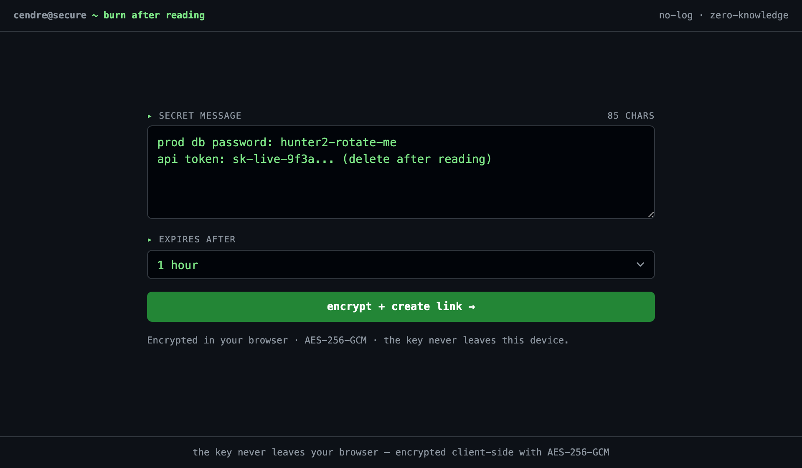

# Cendre: burn after reading

Cendre is a zero-knowledge secret sharing service. You paste a secret, your browser encrypts it, and you get a one-time link. The first person to open the link reads the secret once, and then it's gone.



The secret is encrypted in your browser with AES-256-GCM before anything leaves the page. The backend only ever receives ciphertext and an IV, which it stores in Redis under a key with a TTL. The decryption key lives in the URL fragment (`#key`), so it never reaches the server and never lands in a log. The first successful read deletes the stored secret, so a second read returns `404`. If nobody reads it, Redis drops it when the TTL runs out.

## Running it

```
make run     # start the full stack in the foreground
make logs    # follow logs
make down    # stop everything
```

Once it's up:

- Frontend: http://127.0.0.1:5173
- Backend API: http://127.0.0.1:8080
- Redis: redis://127.0.0.1:6379

Configuration defaults live in `env.example`. Copy it to `.env` if you need to override them.

## Layout

The frontend (`frontend/`) is a React and Vite SPA with two routes: `/` creates a secret and `/s/:id` reveals one. It does the key generation, encryption, decryption, and link building.

The backend (`backend/`) is a small JSON API. It stores each secret as JSON under a `secret:{uuid}` Redis key with a TTL and deletes that key on first read, which is what makes a secret one-time. A `SecretStore` trait sits behind the handlers, with a Redis implementation for real use and an in-memory one for tests. `docker-compose.yml` wires together Redis, the backend, and the nginx-served frontend, which proxies `/api` to the backend.
